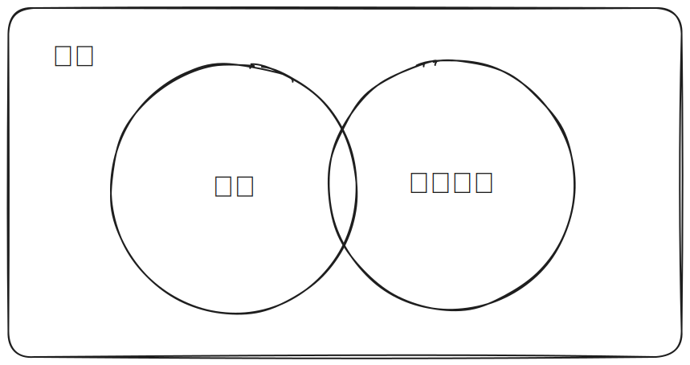
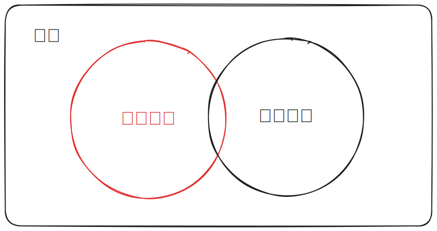
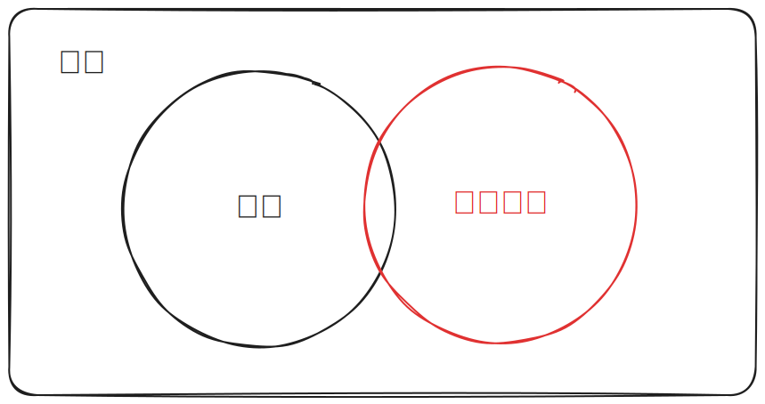

---
# You can also start simply with 'default'
theme: seriph
title: Effective Debug
class: text-center
# https://sli.dev/features/drawing
drawings:
  persist: false
# slide transition: https://sli.dev/guide/animations.html#slide-transitions
transition: slide-left
# enable MDC Syntax: https://sli.dev/features/mdc
mdc: true
---

# Effective Debug

---

## 用科學方法來 Debug

1. 收集資訊
2. 建立假設
3. 驗證假設

---

## 程式是什麼？

---

---

---

## 收集資訊

資料如何改變的

---

<h1>DevTool</h1>

---

## Breakpoints

- Normal breakpoints
- Conditional breakpoints
- Log point

---

## How to use breakpoint to break when calling setState with a specific value

::react-demo

---

## Console Magic

- `debug()`
- `$` and `$$`
- `$0`
- `copy()`

---

## The `console.log()` and their friends

- `console.dir()`
- `console.table()`
- `console.trace()`
